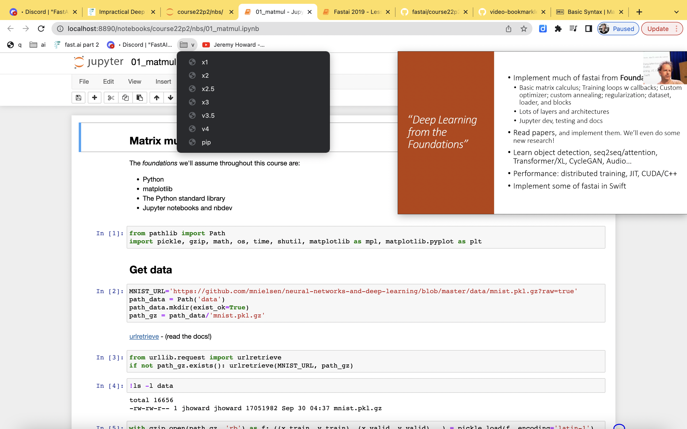

# Video bookmarklets for productivity and fun

Youtube and other video players only allow you to listen to 2x speed max. But your brain can handle more. After a while you will get used to faster and faster speeds. It is useful in certain situations.

### Step 1
Create a folder in your bookmarks bar, called "v"

### Step 2
Create a bookmark with the name `3x` and give it this url `javascript:document.querySelector('video').playbackRate=3`
Do the same for all the speed steps you want, i recommend going from 1 to 3.5 in 0.25 increment steps, that way your brand readjusts to the speed.

### Step 3
Create a bookmark called `pip` with this url `javascript:((function()%7B%5Bdocument%2C...%5B...document.querySelectorAll(%22iframe%22)%5D.map(iframe%20%3D%3E%20iframe.contentDocument).filter(iframe%20%3D%3E%20!!iframe)%5D.some(d%20%3D%3E%5B...d.querySelectorAll(%22video%22)%5D.filter(video%20%3D%3E%20video.paused%20%3D%3D%20false%20%26%26%20video.ended%20%3D%3D%20false).some(video%20%3D%3E%20!!video.requestPictureInPicture().catch(err%20%3D%3E%20console.log(err))))%7D)())`

This will allow you to have a small "picture in picture" for the vide you are viewing.
(Although if you want to change the speed while showing picture-in-picture, you have to be in the tab that has the video element)
